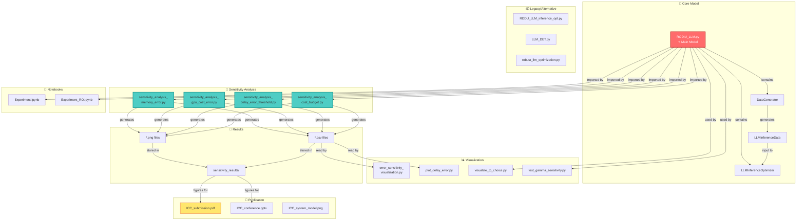
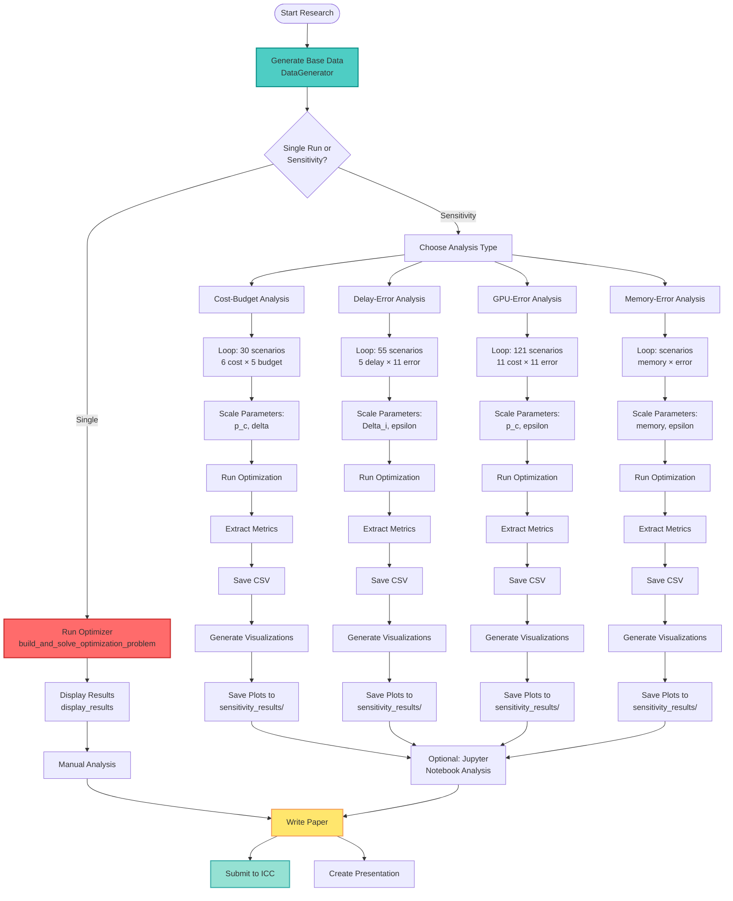
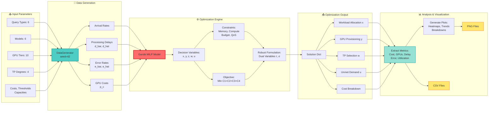

# ICC Conference Project Structure & Relationships

## Directory Tree

```
ICC conference/
│
├── 📦 Core Optimization Models
│   ├── RODIU_LLM.py                          ⭐ Main robust optimization model
│   ├── RDDU_LLM_inference_opt.py             Earlier version
│   ├── LLM_DET.py                            Deterministic baseline
│   ├── robust_llm_optimization.py            Prototype
│   ├── deterministic_full_service.py         Full service variant
│   ├── llm_inference_with_tp.py              TP exploration
│   └── llm_workload_allocation.py            Basic allocation
│
├── 🔬 Sensitivity Analysis Scripts
│   ├── sensitivity_analysis_cost_budget.py           GPU cost × Budget
│   ├── sensitivity_analysis_delay_error_threshold.py Delay × Error
│   ├── sensitivity_analysis_gpu_cost_error.py        GPU cost × Error
│   └── sensitivity_analysis_memory_error.py          Memory × Error
│
├── 📊 Visualization & Analysis Tools
│   ├── error_sensitivity_analysis.py
│   ├── error_sensitivity_visualization.py
│   ├── plot_delay_error.py
│   ├── test_gamma_sensitivity.py
│   ├── visualize_tp_choice.py
│   ├── analyze_constraint_formulation.py
│   ├── constraint_analysis.py
│   └── print_gpu_tier_details.py
│
├── 📓 Jupyter Notebooks
│   ├── Experiment.ipynb                      Interactive experiments
│   └── Experiment_RO.ipynb                   Robust vs Deterministic
│
├── 🗂️ Data & Results
│   ├── sensitivity_results/                  (230 files)
│   │   ├── *.csv                            Numerical results
│   │   └── *.png                            Visualizations
│   ├── sensitivity_analysis/                 (8 CSV files)
│   └── plot/                                 (15 publication figures)
│       ├── *.jpg
│       ├── *.fig
│       └── sensitivity_plot_visulization.m
│
├── 📄 Documentation
│   ├── README.md
│   ├── ERROR_SENSITIVITY_ANALYSIS.md
│   └── ERROR_SENSITIVITY_README.md
│
├── 📑 Publication Materials
│   ├── ICC_submission.pdf                    Conference paper
│   ├── ICC_conference.pptx                   Presentation slides
│   ├── ICC_system_model.png                  System diagram
│   ├── system_model.jpg                      Alternative diagram
│   └── Latency_aware_Robust_LLM_...pdf       Preprint
│
├── ⚙️ Configuration
│   ├── requirements.txt                      Dependencies
│   ├── parameter_setup.py                    Default parameters
│   └── __pycache__/                          Python cache
│
└── 📈 Generated Data Files
    ├── delay_all_queries.png
    ├── delay_error_analysis.png
    ├── error_rate_all_queries.png
    ├── tp_degree_visualization.png
    ├── delay_sensitivity_results.csv
    ├── error_sensitivity_results.csv
    └── gamma_sensitivity_results.csv
```

---

## File Dependency Graph



---

## Execution Flow



---

## Data Flow Diagram



---

## Module Relationship Matrix

| Module | RODIU_LLM.py | Sensitivity Scripts | Visualization Tools | Notebooks | Results Dir |
|--------|--------------|---------------------|---------------------|-----------|-------------|
| **RODIU_LLM.py** | - | ✅ Imported | ✅ Imported | ✅ Imported | ❌ |
| **Sensitivity Scripts** | ✅ Imports | - | ❌ | ❌ | ✅ Writes |
| **Visualization Tools** | ✅ Some import | ❌ | - | ❌ | ✅ Reads/Writes |
| **Notebooks** | ✅ Imports | ❌ | ❌ | - | ✅ Reads/Writes |
| **Results Dir** | ❌ | ✅ Read from | ✅ Read from | ✅ Read from | - |

---

## Key File Relationships

### 1️⃣ Core Model Dependencies
```
RODIU_LLM.py
    ├── gurobipy (Gurobi optimizer)
    ├── numpy (numerical arrays)
    ├── pandas (data structures)
    └── dataclasses (data containers)
```

### 2️⃣ Sensitivity Analysis Pattern
```
sensitivity_analysis_*.py
    ├── RODIU_LLM.DataGenerator
    ├── RODIU_LLM.LLMInferenceOptimizer
    ├── matplotlib.pyplot
    ├── seaborn
    └── Output:
        ├── sensitivity_results/{name}_{timestamp}.csv
        └── sensitivity_results/{plot_type}_{timestamp}.png
```

### 3️⃣ Visualization Dependencies
```
plot_delay_error.py
    └── Generates:
        ├── delay_all_queries.png
        ├── delay_error_analysis.png
        └── error_rate_all_queries.png

visualize_tp_choice.py
    └── Generates:
        └── tp_degree_visualization.png

error_sensitivity_visualization.py
    ├── Reads: error_sensitivity_results.csv
    └── Generates: error analysis plots
```

### 4️⃣ Publication Pipeline
```
RODIU_LLM.py
    └── Sensitivity Analysis
        └── sensitivity_results/*.png
            └── plot/ (curated figures)
                └── ICC_submission.pdf
                └── ICC_conference.pptx
```

---

## Typical Usage Patterns

### Pattern 1: Single Optimization Run
```bash
python RODIU_LLM.py
# Output: Console display of results
```

### Pattern 2: Sensitivity Analysis
```bash
python sensitivity_analysis_cost_budget.py
# Output:
#   - sensitivity_results/sensitivity_cost_budget_{timestamp}.csv
#   - sensitivity_results/heatmaps_cost_budget_{timestamp}.png
#   - sensitivity_results/cost_trends_cost_budget_{timestamp}.png
#   - (5+ visualization files)
```

### Pattern 3: Interactive Exploration
```bash
jupyter notebook Experiment.ipynb
# Imports RODIU_LLM, runs custom scenarios
```

### Pattern 4: Generate Publication Figures
```bash
python plot_delay_error.py
python visualize_tp_choice.py
# Output: High-quality figures in current directory
# Then manually move to plot/ directory
```

---

## File Size Distribution

| Category | Files | Total Size |
|----------|-------|------------|
| **Core Python** | 20 files | ~500 KB |
| **Notebooks** | 2 files | ~4.4 MB |
| **PDFs** | 3 files | ~4.5 MB |
| **Presentation** | 1 file | ~2.4 MB |
| **Images** | ~250 files | ~50+ MB |
| **Results CSV** | ~100 files | ~5 MB |
| **Documentation** | 3 MD files | ~50 KB |
| **Total** | ~380 files | ~65+ MB |

---

## Version History (Inferred)

```
Version 1: llm_workload_allocation.py
    └── Basic workload allocation, no TP, no robustness

Version 2: robust_llm_optimization.py
    └── Added robust optimization, but no TP

Version 3: llm_inference_with_tp.py
    └── Explored tensor parallelism

Version 4: RDDU_LLM_inference_opt.py
    └── Combined robust + TP, early version

Version 5: RODIU_LLM.py ⭐ CURRENT
    └── Refined model with decision-dependent uncertainty
    └── Full constraint analysis
    └── Production-ready code
```

---

## Quick Reference

### 🎯 Want to run the main model?
→ `python RODIU_LLM.py`

### 🔬 Want to do sensitivity analysis?
→ `python sensitivity_analysis_*.py`

### 📊 Want to visualize existing results?
→ Check `sensitivity_results/` directory

### 📓 Want to experiment interactively?
→ `jupyter notebook Experiment.ipynb`

### 📄 Want to see research output?
→ `ICC_submission.pdf` and `ICC_conference.pptx`

### 🐛 Want to debug constraints?
→ `python constraint_analysis.py` or `analyze_constraint_formulation.py`

---

**Last Updated**: Based on file timestamps up to November 10, 2025
