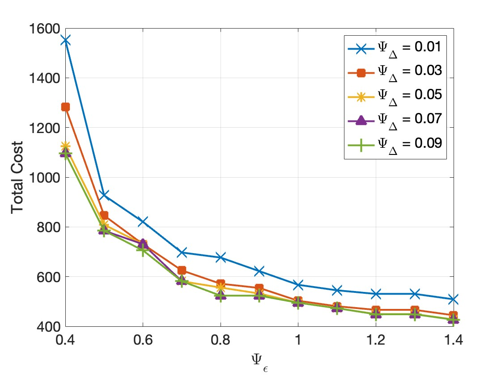
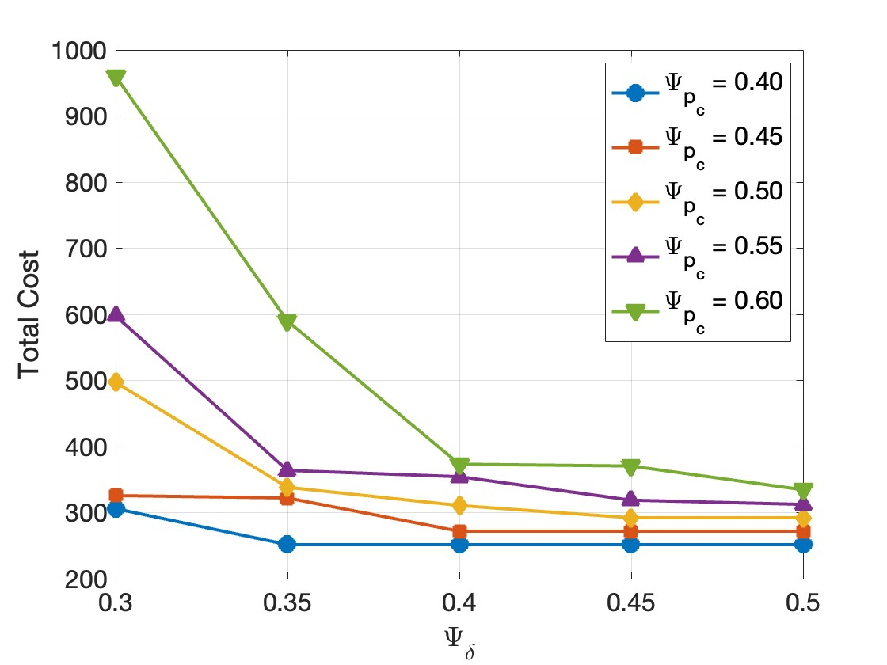
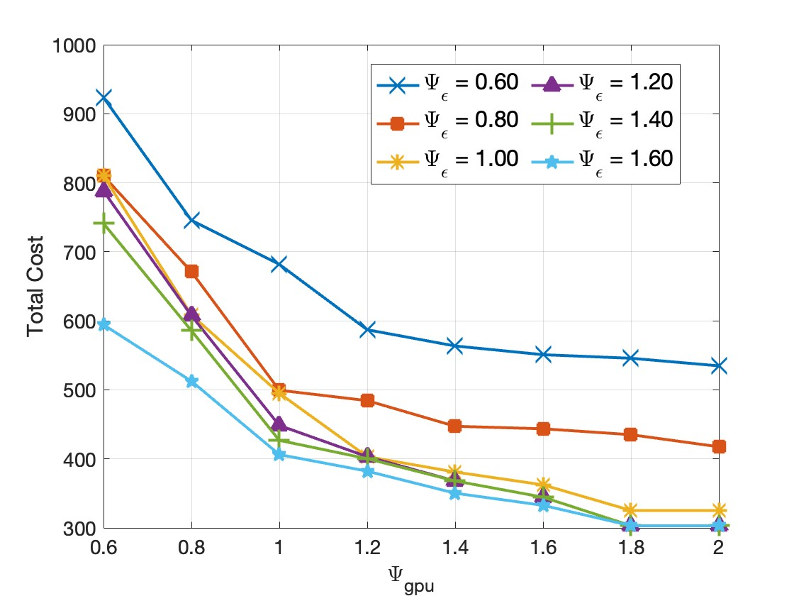
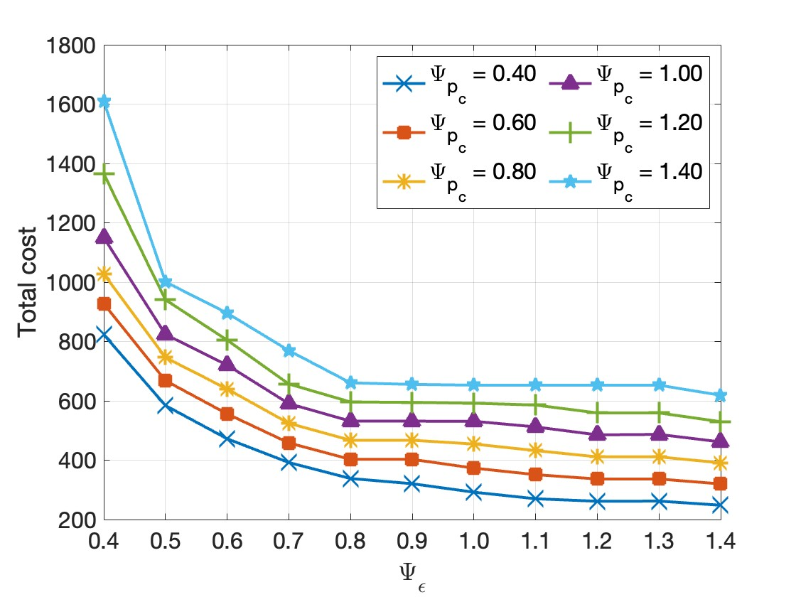

# Robust LLM Inference Workload Allocation

[](https://www.python.org/downloads/)
[](https://www.gurobi.com/)
> **Latency-aware Robust LLM Inference Workload Allocation under Precision-Dependent Uncertainty**

Efficient optimization framework for allocating LLM inference workloads across heterogeneous GPU resources while handling uncertainty in processing delays and error rates. Supports **tensor parallelism**, **decision-dependent uncertainty**, and **multi-precision GPU configurations**.

---

## 🎯 Key Features

- ✅ **Robust Optimization** with decision-dependent uncertainty sets
- ✅ **Tensor Parallelism** support (TP degrees: 1, 2, 4, 8)
- ✅ **Multi-Precision GPU** configurations (FP16, INT8, INT4)
- ✅ **6 Query Types**: Summarization, Code Gen, Translation, Math, Image Gen, Video Gen
- ✅ **6 LLM Models**: Llama-3.2 (1B-70B) with vision support
- ✅ **10 GPU Tiers**: RTX 4090, A6000, A100, H100 variants
- ✅ **Comprehensive Sensitivity Analysis** tools

---

## 📊 Quick Start

### Installation

```bash
# Install dependencies
pip install -r requirements.txt
```

**Requirements**: Python 3.8+, Gurobi (Academic License)

### Basic Usage

```python
from RODIU_LLM import DataGenerator, LLMInferenceOptimizer

# Generate problem instance
generator = DataGenerator(seed=42)
data = generator.generate()

# Build and solve optimization model
optimizer = LLMInferenceOptimizer(data)
solution = optimizer.build_and_solve_optimization_problem(
    time_limit=300,  # seconds
    mip_gap=0.01     # 1% optimality tolerance
)

# Display results
optimizer.display_results(solution)
```

### Run Sensitivity Analysis

```bash
# Analyze GPU cost vs budget tradeoffs
python sensitivity_analysis_cost_budget.py

# Analyze delay vs error threshold impacts
python sensitivity_analysis_delay_error_threshold.py

# Analyze GPU cost vs error rate sensitivity
python sensitivity_analysis_gpu_cost_error.py

# Analyze memory capacity vs error rate
python sensitivity_analysis_memory_error.py
```

---

## 📚 Documentation

| Document | Description |
|----------|-------------|
| **[Project Structure](PROJECT_STRUCTURE.md)** | Complete file organization, dependency graphs, execution flows |
| **[Data Sources & Parameters](DATA_SOURCES_AND_PARAMETERS.md)** | Detailed parameter generation methods, data sources, validation |
| **[Error Sensitivity Analysis](ERROR_SENSITIVITY_ANALYSIS.md)** | Error rate sensitivity study methodology and results |
| **[Constraint Formulation](analyze_constraint_formulation.py)** | Mathematical constraint verification |

---

## 🏗️ System Architecture

### Problem Formulation

**Minimize**: Total Cost = GPU Rental + Storage + Robust Delay Penalty + Unmet Demand Penalty

**Subject to**:
- Supply-demand balance
- Budget constraints
- Memory capacity (with tensor parallelism)
- Compute capacity
- Storage limits
- **Robust delay constraints** (worst-case guarantees)
- **Robust error rate constraints** (precision-dependent)
- Tensor parallelism selection
- Logical consistency

### Decision Variables

| Variable | Type | Description |
|----------|------|-------------|
| **x[i,j,k]** | Continuous [0,1] | Fraction of query type i allocated to model j on GPU k |
| **y[j,k]** | Integer ≥0 | Number of GPUs of tier k allocated to model j |
| **z[i,j,k]** | Binary | Placement decision (query routing) |
| **w[j,k,n]** | Binary | Tensor parallelism degree n selection |
| **u[i]** | Continuous [0,1] | Unmet demand fraction for query type i |
| **τ, σ** | Continuous ≥0 | Dual variables for robust optimization |

### Uncertainty Model

```
Actual Delay = d_bar[i,j,k] + d_hat[i,j,k] × ξ_d
Actual Error = e_bar[i,j,k] + e_hat[i,j,k] × ξ_e

Where: ξ ∈ [0,1], and Σ ξ ≤ Γ (uncertainty budget)
```

---

## 🔬 Research Highlights


Our model captures:
- **GPU tier impact on delays**: Higher compute power (H100 vs A6000) reduces delay uncertainty
- **Precision impact on errors**: Quantization (INT4/INT8 vs FP16) increases error uncertainty
- **Model-GPU pairing effects**: Optimal pairings reduce both delay and error variability

### Performance Characteristics

| Configuration | Processing Delay | Error Rate | Cost ($/hr) |
|--------------|-----------------|------------|-------------|
| **Llama-70B + H100_FP16** | 0.12 ms/token | 0.5% | $2.50 |
| **Llama-8B + A100_INT8** | 0.35 ms/token | 1.2% | $1.20 |
| **Llama-1B + RTX4090_INT4** | 0.08 ms/token | 3.5% | $0.35 |

> H100 provides **~36× speedup** over A6000, while INT8 quantization offers **1.5× additional** acceleration


### Sensitivity Analysis Results

Results are stored in `sensitivity_results/` with visualizations:

- **Heatmaps**: Cost, GPU allocation, performance metrics
- **Trend plots**: Parameter sensitivity curves
- **Breakdown charts**: Cost component stacked bars
- **TP distribution**: Tensor parallelism selection patterns

<p align="center">
  
  
  
  
</p>

---

## 🗂️ Project Structure

```
ICC conference/
├── 📦 Core Models
│   ├── RODIU_LLM.py                          ⭐ Main robust optimization
│   ├── LLM_DET.py                            Deterministic baseline
│   └── parameter_setup.py                    Parameter generation
│
├── 🔬 Sensitivity Analysis
│   ├── sensitivity_analysis_cost_budget.py
│   ├── sensitivity_analysis_delay_error_threshold.py
│   ├── sensitivity_analysis_gpu_cost_error.py
│   └── sensitivity_analysis_memory_error.py
│
├── 📓 Notebooks
│   └── Experiment_RO.ipynb                   Robust vs Deterministic
│
├── 📁 Results
│   └── plot/*.jpg                            Publication figures
│
└── 📄 Documentation
    ├── README.md                             This file
    ├── PROJECT_STRUCTURE.md                  File organization & flows
    ├── DATA_SOURCES_AND_PARAMETERS.md        Parameter generation details
```
---

## 🎓 Model Details

### Query Types & Characteristics

| Type | Input Tokens | Output Tokens | Arrival Rate | Delay Threshold | Error Threshold |
|------|--------------|---------------|--------------|-----------------|-----------------|
| **Summarization** | 512 | 256 | 80-120/hr | 1000 ms | 8% |
| **Code_Gen** | 256 | 512 | 60-100/hr | 1500 ms | 10% |
| **Translation** | 128 | 128 | 100-140/hr | 800 ms | 8% |
| **Math_Solving** | 64 | 256 | 40-80/hr | 2000 ms | 10% |
| **Image_Gen** | 32 | 1024 | 20-60/hr | 4000 ms | 15% |
| **Video_Gen** | 48 | 2048 | 10-30/hr | 5000 ms | 25% |

### GPU Configurations

| GPU Tier | Memory (GB) | Compute (TFLOPs) | Cost ($/hr) | Precision | Use Case |
|----------|-------------|------------------|-------------|-----------|----------|
| **H100 80GB** | 80 | 989-1484 | $2.00-3.00 | FP16/INT8 | Flagship models |
| **A100 40GB** | 40 | 165-468 | $0.96-1.44 | FP16/INT8 | Data center |
| **RTX 4090** | 24 | 77-124 | $0.28-0.42 | FP16/INT8/INT4 | Cost-effective |
| **A6000** | 48 | 41-67 | $0.52-0.78 | FP16/INT8/INT4 | Professional |

See **[DATA_SOURCES_AND_PARAMETERS.md](DATA_SOURCES_AND_PARAMETERS.md)** for complete parameter details and data sources.

---

## 🧪 Parameter Generation

All parameters are generated with realistic distributions based on:

### Data Sources

- **GPU Specifications**: NVIDIA official technical whitepapers
- **Rental Costs**: vast.ai, Lambda Labs, RunPod marketplace (Q4 2024)
- **Model Sizes**: Meta AI Llama model cards
- **Workload Patterns**: "Characterizing LLM Workloads" (Patel et al., 2024)
- **Quantization Impact**: "LLM.int8()" (Dettmers et al., 2022)
- **SLA Pricing**: OpenAI, Anthropic API documentation (2024)

### Key Formulas

**Processing Delay** (ms/token):
```python
d[i,j,k] = base_delay[i] × model_multiplier[j] × (reference_power / P_gpu[k])
```

**Error Rate** (fraction):
```python
e[i,j,k] = (base_error[i] / model_capacity[j]) × precision_factor[k]

Where:
  precision_factor[FP16] = 1.0
  precision_factor[INT8] = 1.15  # +15% quantization error
  precision_factor[INT4] = 1.35  # +35% quantization error
```

**Uncertainty Deviations**:
```python
d_hat[i,j,k] ~ Uniform(0.10, 0.25) × d_bar[i,j,k]  # 10-25% of nominal
e_hat[i,j,k] ~ Uniform(0.10, 0.25) × e_bar[i,j,k]
```

---

## 📊 Sensitivity Analysis

### Available Analyses

1. **Cost-Budget Sensitivity** (`sensitivity_analysis_cost_budget.py`)
   - Parameters: GPU rental cost × Budget threshold
   - Grid: 6 × 5 = 30 scenarios
   - Insights: Budget utilization, cost breakdown, GPU allocation patterns

2. **Delay-Error Threshold Sensitivity** (`sensitivity_analysis_delay_error_threshold.py`)
   - Parameters: Delay threshold × Error threshold
   - Grid: 5 × 11 = 55 scenarios
   - Insights: Constraint utilization, QoS tradeoffs, TP distribution

3. **GPU Cost-Error Sensitivity** (`sensitivity_analysis_gpu_cost_error.py`)
   - Parameters: GPU cost scaling × Error threshold
   - Grid: 11 × 11 = 121 scenarios
   - Insights: Cost-accuracy tradeoffs, GPU tier selection

4. **Memory-Error Sensitivity** (`sensitivity_analysis_memory_error.py`)
   - Parameters: Memory capacity × Error threshold
   - Insights: Resource-quality tradeoffs

### Sample Results

```bash
$ python sensitivity_analysis_cost_budget.py

SENSITIVITY ANALYSIS: GPU RENTAL COST & BUDGET
================================================================================
Running 30 scenarios...
[1/30] p_c_scale=0.4, delta_scale=0.3
  ✓ OPTIMAL: Total Cost = $1,247.89, Gap = 0.0032

Results saved to: sensitivity_results/sensitivity_cost_budget_20251124_153042.csv

Generating visualizations...
  Saved: heatmaps_cost_budget_20251124_153042.png
  Saved: cost_trends_cost_budget_20251124_153042.png
  Saved: cost_breakdown_cost_budget_20251124_153042.png
  Saved: budget_analysis_20251124_153042.png
```

---

## 🔧 Advanced Configuration

### Adjusting Uncertainty Budgets

```python
# More conservative (higher robustness)
data.Gamma_d = 30  # Allow 30/60 configurations to reach worst-case delay
data.Gamma_e = 30  # Allow 30/60 configurations to reach worst-case error

# Less conservative (lower cost)
data.Gamma_d = 5   # Only 5/60 worst-case scenarios
data.Gamma_e = 5
```

### Custom Parameter Ranges

```python
# Adjust arrival rates
data.lambda_i = np.array([150, 120, 200, 80, 50, 40])  # Higher traffic

# Relax QoS constraints
data.Delta_i *= 1.5  # +50% delay tolerance
data.epsilon *= 1.2  # +20% error tolerance

# Scale budget
data.delta = 5000
```

### Solver Settings

```python
solution = optimizer.build_and_solve_optimization_problem(
    time_limit=600,    # 10 minutes (default: 300s)
    mip_gap=0.005      # 0.5% optimality (default: 0.01)
)
```

## 📄 License

This project is for **academic research purposes** only.

**Gurobi License**: Academic license required. For commercial use, obtain a commercial Gurobi license.


<p align="center">
  <b>⭐ Star this repository if you find it helpful!</b>
</p>
